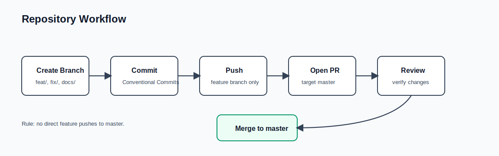

# Contributing

This repository uses pull requests for all feature, CAD, documentation, and workflow changes.



## Branch Workflow

Do not push changes directly to `master`.

Use a short-lived branch:

```powershell
git checkout -b feat/your-change-name
```

Then commit, push the branch, and open a pull request into `master`.

## Pull Request Checklist

- Describe what changed and why.
- Link related notes, issues, or design decisions when relevant.
- For OpenSCAD changes, include which `outputMode` values were exported successfully.
- Keep generated STL, PNG, and temporary review files out of the commit unless they are intentional project artifacts.

## CAD Verification

Use OpenSCAD Nightly for CAD checks:

```powershell
& 'C:\Program Files\OpenSCAD (Nightly)\openscad.com' -D 'outputMode="Assembly"' -o assembly.stl cad\openscad\main.scad
& 'C:\Program Files\OpenSCAD (Nightly)\openscad.com' -D 'outputMode="Print Layout"' -o print-layout.stl cad\openscad\main.scad
```

At minimum, verify the modes affected by your change.
