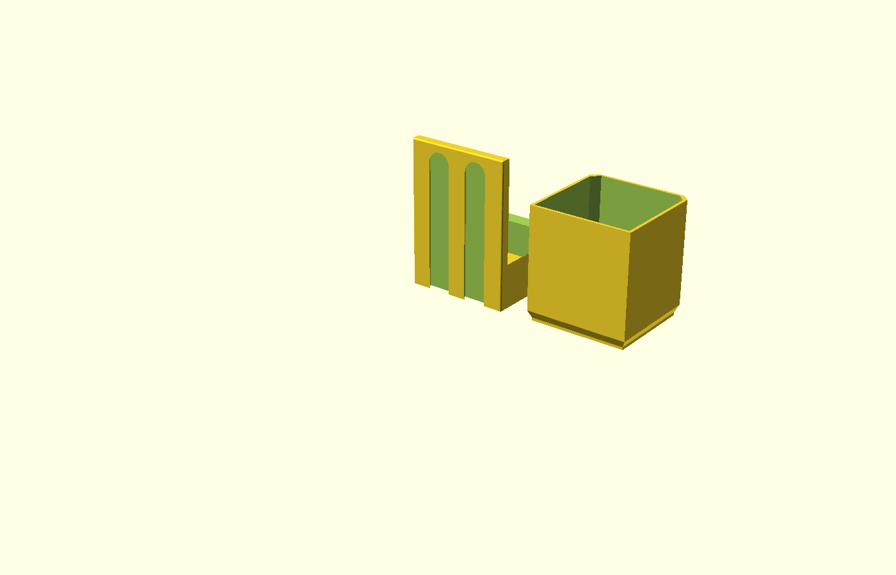

# OpenGarden

OpenGarden is a modular self-watering planter project built around OpenGrid-style mechanical mounting, 3D-printed parts, and a future ESP32-based watering controller.

The current work is focused on the mechanical CAD for a wall-mounted holder, drain/reservoir area, and removable pot insert. Electronics, firmware, backend, and UI folders are reserved for later phases.


## Current Status

- OpenSCAD CAD modules for the holder, drain pan, back plate, and pot insert
- BOSL2 attachable anchors for assembling the pot insert into the holder
- Main OpenSCAD entry point with assembly and print/export layouts
- Research and design notes for self-watering strategies

## Repository Layout

```text
OpenGarden/
  cad/
    openscad/                 OpenSCAD CAD source files
  docs/
    mechanical/               Mechanical design notes
    self_watering_research/   Research notes and reference images
    self_watering_design.md   Current system design direction
  assets/                     Project assets
  backend/                    Reserved for backend services
  electronics/                Reserved for circuit/electronics files
  firmware/                   Reserved for ESP32 firmware
  scripts/                    Reserved for helper scripts
  ui/                         Reserved for user interface work
```

## CAD Workflow

The main CAD entry point is:

```text
cad/openscad/main.scad
```

Open it in OpenSCAD Nightly and use the `Output_Mode` customizer value:

```scad
Output_Mode = "Assembly"; // [Assembly, Freestanding Pot, Print Layout, Holder Only, Drain Only, Pot Insert Only]
OpenGrid_Support = true;
```

Modes:

- `Assembly`: shows either the OpenGrid holder assembly or the freestanding drain/pot assembly, based on `OpenGrid_Support`
- `Freestanding Pot`: assembles the drain pan and pot insert without the OpenGrid back plate
- `Print Layout`: places the printable parts side by side; with `OpenGrid_Support = true` it shows the holder and pot insert, and with `OpenGrid_Support = false` it shows the drain pan and pot insert
- `Holder Only`: exports just the holder
- `Drain Only`: exports just the drain pan/reservoir section
- `Pot Insert Only`: exports just the removable insert



Set `OpenGrid_Support = false` when printing a freestanding pot that does not mount to OpenGrid.

Set `Chamfer_Back_Side = true` to apply the side chamfer to both sides of the freestanding drain pan and pot insert. OpenGrid holder mode keeps the holder-facing chamfer style.

For OpenGrid holders, `Subtracted_Slots` reduces the back-plate slot count and `Slot_Placement` controls whether the remaining slots stay centered, move to the left/right side of the plate, or spread across valid OpenGrid positions.

The insert drain hole pattern can be set with `Hole_Pattern` and adjusted with `Hole_Rows`, `Hole_Columns`, `Hole_Diameter`, and `Hole_Area_Padding`. The pattern is generated inside each pot insert grid cell. `Rectangle` uses rows and columns; `Circle` uses rows as a maximum ring count and columns as holes per ring. Circle mode may use fewer rings when a cell is too small to fit the requested rings cleanly.

The pot insert interior is always treated as a grid. The default `Grid_Rows = 1` and `Grid_Columns = 1` creates one open compartment, while larger values add solid internal divider walls. `Grid_Wall_Thickness` controls the divider wall thickness.

The print layout spacing can be adjusted with:

```scad
Print_Spacing = 20;
```

## CAD Dependencies

The OpenSCAD files use [BOSL2](https://github.com/BelfrySCAD/BOSL2). The project has been tested with OpenSCAD Nightly.

Expected local OpenSCAD path on the current development machine:

```text
C:\Program Files\OpenSCAD (Nightly)
```

To export from the command line:

```powershell
& 'C:\Program Files\OpenSCAD (Nightly)\openscad.com' -o output.stl cad\openscad\main.scad
```

To export a specific mode:

```powershell
& 'C:\Program Files\OpenSCAD (Nightly)\openscad.com' -D 'Output_Mode="Print Layout"' -o print-layout.stl cad\openscad\main.scad
```

## Design Direction

The project is moving toward an active pump-based self-watering system:

- removable pot insert
- drain/reservoir section
- OpenGrid-compatible mounting
- future ESP32 pump control
- later support for moisture or water-level sensors

See [docs/self_watering_design.md](docs/self_watering_design.md) for the current design notes.

## Development Notes

- Keep CAD modules reusable and avoid rendering sample objects from library files.
- Define shared BOSL2 anchor names in `cad/openscad/anchor_names.scad`.
- Use `main.scad` as the output/export entry point.
- Validate OpenSCAD changes by exporting the relevant `Output_Mode` values.
- Pull requests that change OpenSCAD files generate STL preview artifacts through GitHub Actions.
- Do not push feature work directly to `master`; create a branch and open a pull request first.

## Contributing

Use short-lived branches for changes:

```powershell
git checkout -b feat/your-change-name
```

Before opening a pull request, verify any CAD changes with OpenSCAD Nightly and include the tested `Output_Mode` values in the PR description. See [CONTRIBUTING.md](CONTRIBUTING.md) for the repository workflow.
