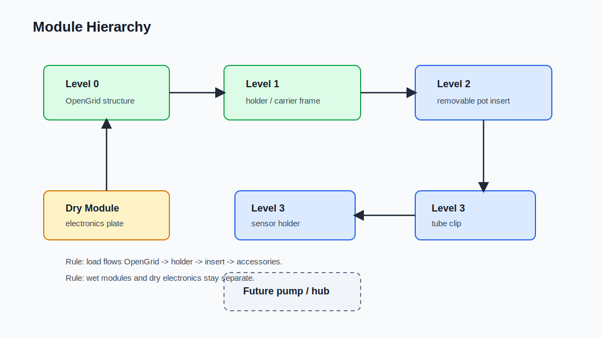
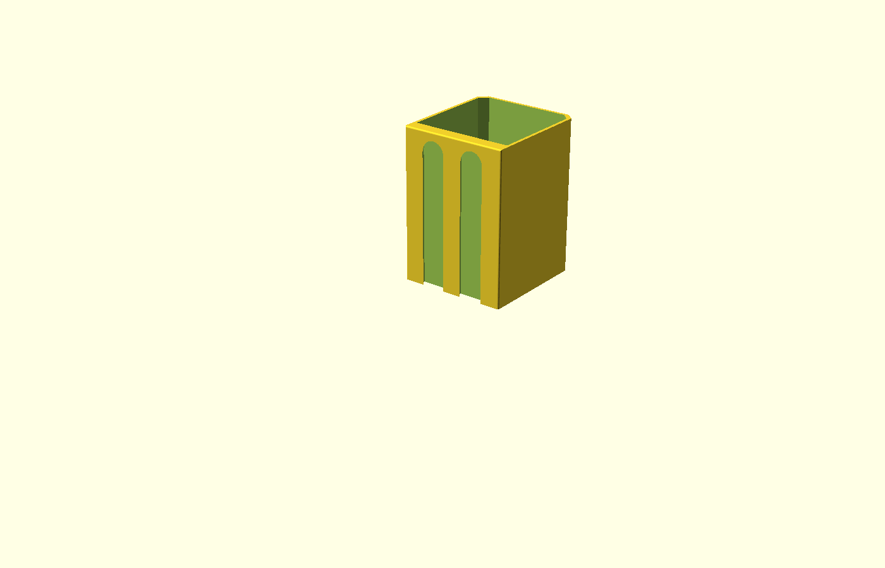

# Mechanical Step 02 — OpenGrid Architecture

## Purpose

This step redesigns the mechanical architecture around OpenGrid as the structural base.

The previous pot-first approach was rejected because the system requires a real load-bearing attachment to OpenGrid. The corrected design uses a carrier-first model.

## Module hierarchy

- OpenGrid interface abstraction
- Carrier frame (structural)
- Pot insert (removable)
- Sensor holder (insert-mounted)
- Tube clip (insert-mounted)
- Electronics plate (OpenGrid-mounted)

## Design rules

- Load path goes through carrier and OpenGrid
- Pot insert is removable and non-structural
- Wet and dry modules remain separate
- OpenGrid geometry is abstracted into an interface layer until exact dimensions are confirmed

## Outcome

This step establishes the correct CAD and structural foundation for the MVP node.

## Current CAD Implementation

The current OpenSCAD implementation is in `cad/openscad/`:

- `main.scad`: output entry point for assembly, print layout, holder-only, and pot-insert-only exports
- `pot_holder_frame.scad`: OpenGrid-mounted holder/carrier module
- `pot_insert.scad`: removable insert module
- `pot_drain.scad`: drain/reservoir geometry used by the holder
- `back_plate.scad`: OpenGrid/multiconnect mounting plate
- `anchor_names.scad`: shared BOSL2 anchor-name constants

The holder and insert are assembled using named BOSL2 anchors so the CAD can show both the fit-check assembly and a separated print layout.

