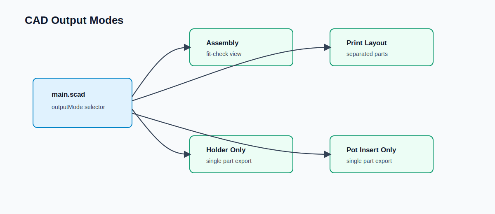

# CAD Layout

## Purpose

Defines how OpenSCAD files are structured and organized.



---

## Current Folder Structure

```text
cad/openscad/
  anchor_names.scad
  back_plate.scad
  main.scad
  pot_drain.scad
  pot_holder_frame.scad
  pot_insert.scad
```

`main.scad` is the entry point for previewing or exporting:

- `Assembly`
- `Freestanding Pot`
- `Print Layout`
- `Holder Only`
- `Drain Only`
- `Pot Insert Only`

The `OpenGrid_Support` flag selects whether shared modes are for the OpenGrid-mounted holder or the freestanding drain/pot pair:

- `OpenGrid_Support = true`: `Assembly` and `Print Layout` use the holder and pot insert.
- `OpenGrid_Support = false`: `Assembly` and `Print Layout` use the drain pan and pot insert.

---

## Target Folder Structure

As the project grows, the CAD can move toward this structure:

```text
cad/openscad/

- params/
  - Global parameters (MVP + OpenGrid)

- lib/
  - Shared helpers and utilities

- interfaces/
  - External system adapters (OpenGrid)

- modules/
  - Individual printable parts

- assemblies/
  - Combined previews

- main.scad
  - Entry point
```

---

## Rules

### 1. No Hardcoding
All dimensions must come from `params/`.

---

### 2. One Responsibility Per File
Each file defines exactly one module.

---

### 3. Assemblies Are Non-Destructive
Assemblies must NOT merge parts into one solid.

They are only for preview.

---

### 4. Interfaces Are Isolated
All OpenGrid-specific logic must be inside:

interfaces/opengrid_interface.scad

---

### 5. Reusability

Modules must:
- not depend on assembly files
- not assume fixed positions
