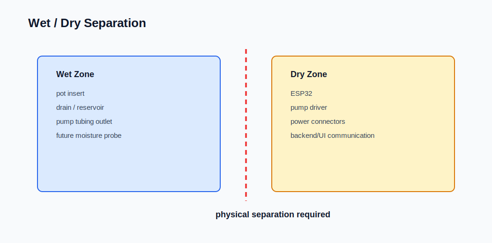

# Structural Rules

## Purpose

Defines mechanical and architectural constraints for all modules.

---

## 1. Load Path

All weight must be transferred through:

OpenGrid → Carrier

The insert must NOT carry structural load.

---

## 2. Wet vs Dry Separation

- Wet modules:
  - Pot insert
  - Sensor holder
  - Tube clip

- Dry modules:
  - Electronics plate

These must NEVER be combined.

---

## 3. Replaceability

Each module must be replaceable independently.

Forbidden:
- One-piece designs combining multiple modules

---

## 4. Mounting Rules

- Only carrier and electronics attach to OpenGrid
- Insert must be removable without tools
- Accessories must not block insert removal

---

## 5. Printability

All parts must:
- print without complex supports
- avoid extreme overhangs
- use consistent wall thickness

---

## 6. Parametric Design

All dimensions must come from parameter files.

Forbidden:
- hardcoded dimensions inside modules
