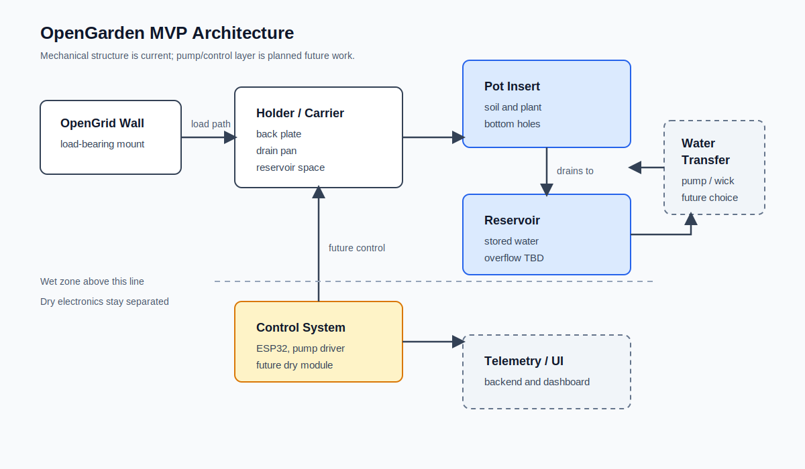

# Self-Watering System Design

## Overview

This document defines the design approach for the self-watering system used in the OpenGarden project.

The goal is to build a **modular, reliable, and maintainable system** that integrates:

- OpenGrid mechanical mounting
- 3D-printed components
- ESP32-based control
- Optional automation and telemetry



---

## System Architecture

The system is divided into clear layers:

### 1. Holder (current module)
- mounted to openGrid
- contains reservoir
- provides structural support

### 2. Insert (current module)
- holds plant and soil
- interfaces with water system
- removable

### 3. Reservoir
- stores water
- located below insert
- accessible for refill

### 4. Water Transfer
- passive (wick)
- active (pump)
- hybrid (future)

### 5. Control System (future)
- ESP32
- sensors
- automation logic
- backend integration (.NET)

---

## Watering Approaches

### Passive (Wick-based)

Water moves via capillary action from reservoir to soil.

**Pros**
- simple
- no electronics
- reliable

**Cons**
- hard to control
- depends on material and environment

**Use case**
- fallback or simple MVP

---

### Passive (Reservoir + Air Gap)

A separated reservoir with controlled contact to soil.

**Key design elements**
- overflow height
- air gap
- controlled contact area

**Risks**
- root rot if poorly designed
- stagnant water

---

### Active (Pump-based) — Recommended

Water is delivered using a pump controlled by ESP32.

**Pros**
- precise control
- scalable
- software-driven

**Cons**
- more components
- requires power
- needs isolation from water

**Conclusion**
👉 This is the target architecture for OpenGarden

---

### Hybrid (Future)

Combine:
- passive baseline moisture
- active correction via pump

**Goal**
- resilience + precision

---

## Reservoir Design

The reservoir is critical and must be treated as a first-class component.

### Requirements

- visible or measurable water level
- easy refill
- easy cleaning
- no dead zones
- stable mounting

### Must-have features

- overflow control
- defined max water level
- air gap above water
- separation from electronics

---

## Insert Design

The insert defines how the plant interacts with the system.

### Core requirements

- removable
- stable seating
- drainage or intake holes
- root aeration

### Optional features

- tube entry (for pump)
- sensor slot
- wick support

### MVP design

- simple tapered shape
- bottom holes
- clean seating edge
- no locking mechanisms yet

---

## Water Transfer Strategy (MVP Decision)

### Selected approach:
👉 **Active pump-based watering**

### Initial behavior:
- timed watering (no sensors first)
- fixed intervals
- manual tuning

### Later upgrades:
- moisture sensor
- adaptive watering
- remote control

---

## Overflow Strategy

Overflow is mandatory.

### Without it:
- roots drown
- system becomes unstable
- maintenance increases

### Implementation options

- side overflow hole
- insert height limiting water level
- fill tube with max indicator

---

## Aeration Strategy

Plants require oxygen in the root zone.

### Avoid:
- constant saturation
- full water contact
- sealed reservoir

### Ensure:
- air gap exists
- roots are not submerged continuously

---

## Electronics Considerations

### Separation

- water and electronics must be isolated
- no exposed wiring near reservoir

### Pump system

- small DC pump
- tubing routing through holder
- optional check valve

### Sensors (later)

- moisture sensor (optional)
- water level sensor (optional)

⚠️ Sensors are unreliable long-term → design for replacement

---

## Failure Modes

### Mechanical

- reservoir impossible to clean
- pot difficult to remove
- refill opening too small
- leakage at tubing entry

### Biological

- root rot
- algae growth
- odor from stagnant water

### Electrical

- water leaks into electronics
- poor cable routing
- unstable pump behavior

### Software

- sensor overtrust
- no fallback watering limit
- unstable calibration assumptions
- too many rules too early

---

## Design Principles

1. Keep modules independent
2. Design for cleaning
3. Avoid early overengineering
4. Validate with real prints early
5. Prefer simple geometry over clever geometry
6. Build for iteration, not perfection

---

## Current Status

### Completed
- OpenGrid-mounted holder
- drain/reservoir space
- removable pot insert
- shared OpenSCAD anchors for holder/insert assembly
- `main.scad` output modes for assembly, print layout, and single-part export

### Next Step
- validate the printed holder and pot insert fit
- define overflow behavior and water line
- decide where pump tubing should enter the insert

---

## Insert Design Direction

### Recommended:
👉 **Active-ready insert**

Features:
- bottom intake/drain holes
- tube entry
- optional sensor position
- compatible with future upgrades

---

## Development Plan

### Phase 1 (current)
- holder design ✔
- research ✔
- pot insert design ✔
- assembly and print export modes ✔

### Phase 2
- print validation
- overflow and refill design
- basic pump integration

### Phase 3
- ESP32 control
- timed watering

### Phase 4
- sensors
- automation logic

---

## Summary

The system will evolve in clear stages:

```text
Simple holder
→ Insert
→ Reservoir behavior
→ Pump integration
→ ESP32 control
→ Sensor support
→ Smart automation
