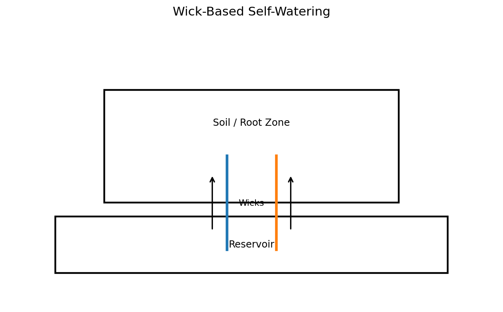
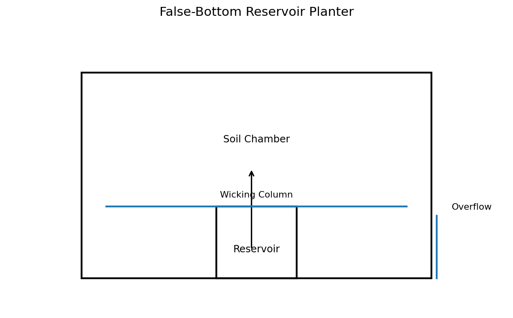
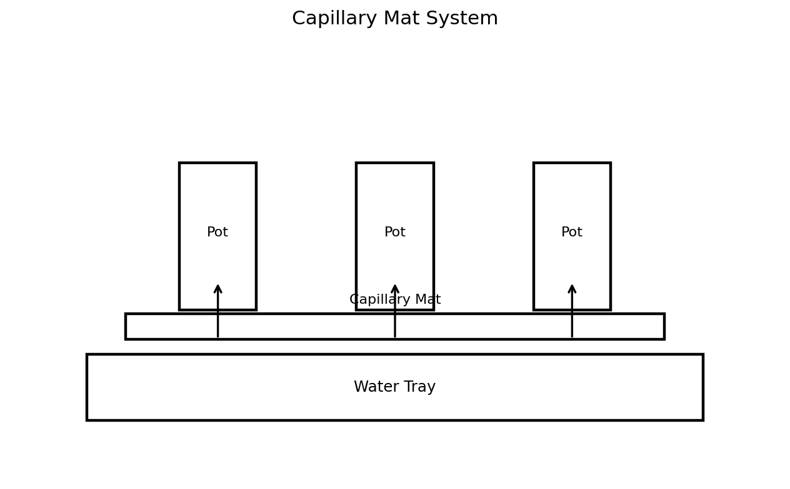
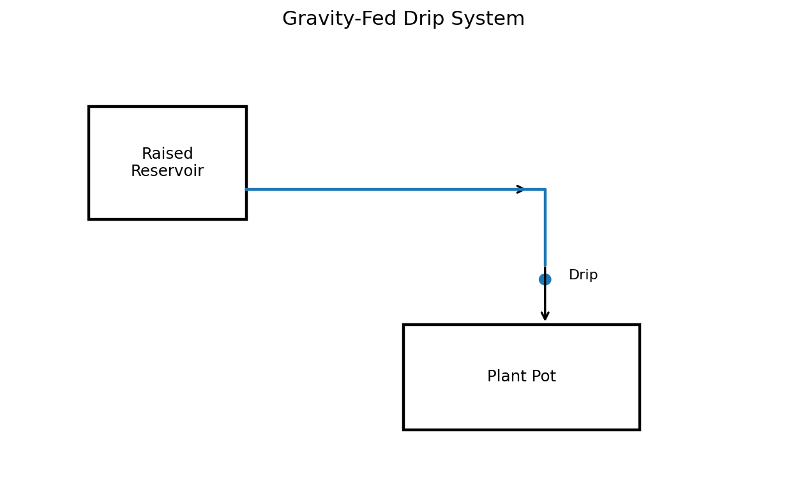
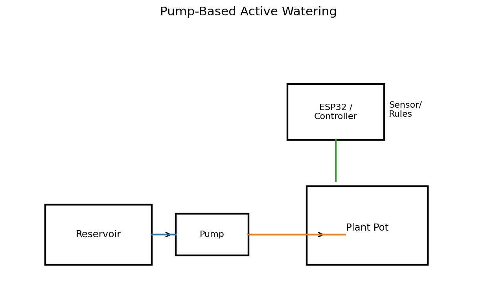
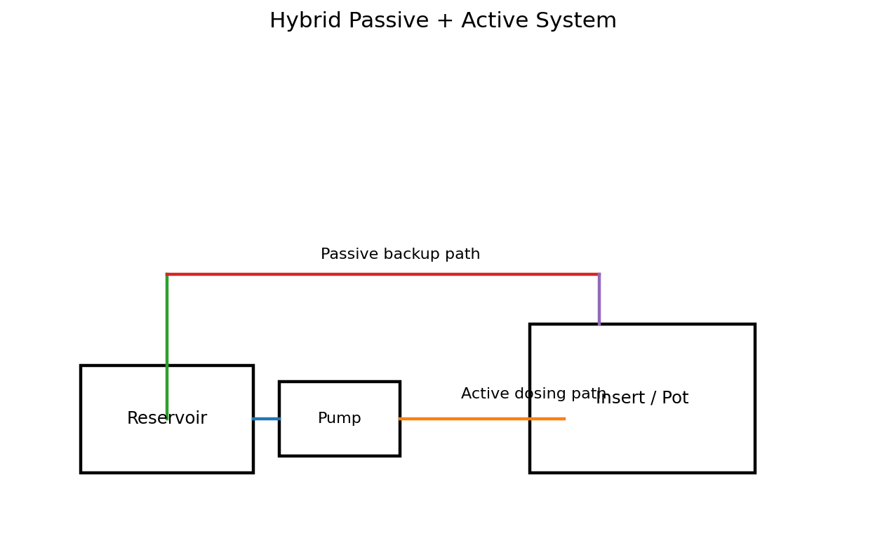
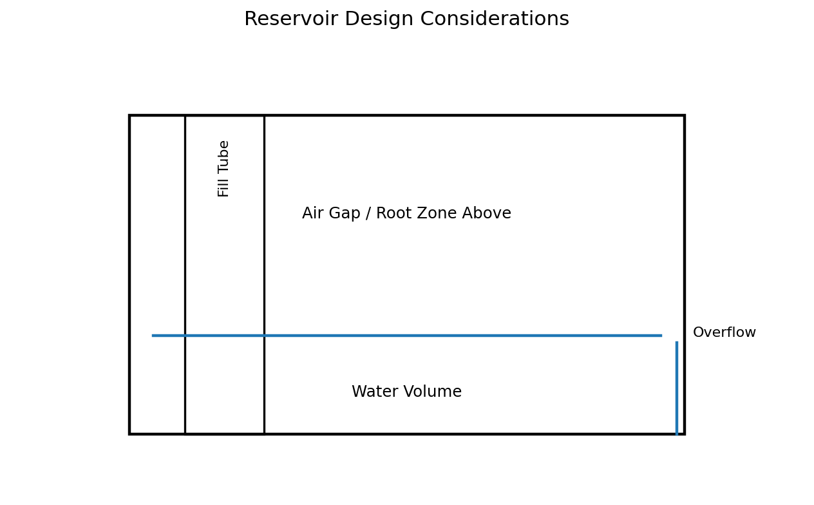
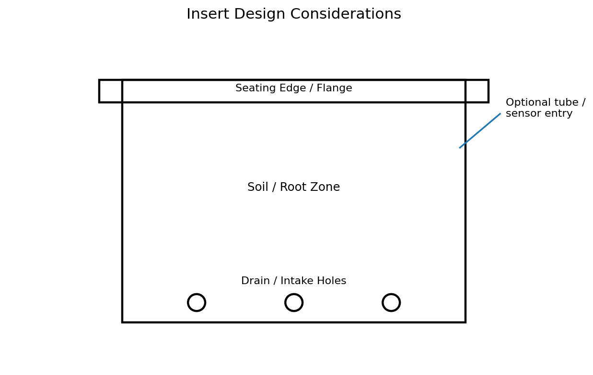

# Self-Watering Systems Research Notes

## Purpose

This document summarizes practical self-watering system architectures for a modular plant holder/pot system. It is written to help choose an MVP approach and avoid common design mistakes before spending too much time on CAD, electronics, or control logic.

---

## What “self-watering” really means

A self-watering system reduces manual watering by controlling how water moves from stored water into the plant root zone.

There are two main categories:

1. **Passive systems**
   - water moves without powered control
   - simpler, cheaper, and usually more reliable
   - harder to tune precisely

2. **Active systems**
   - water is moved by pump, valve, or controlled dosing
   - more flexible and measurable
   - more parts and more failure modes

For this project, it helps to think in layers:

- **Holder**: the outer structural part mounted to openGrid
- **Insert / inner pot**: the plant container
- **Reservoir**: stored water
- **Transfer mechanism**: wick, capillary media, pump, valve, etc.
- **Control layer**: optional ESP32, sensors, rules, dashboard

---

## 1. Wick-based self-watering

### How it works
A wick connects the water reservoir to the soil or growing medium. Water rises into the root zone through capillary action.

### Typical parts
- reservoir below pot
- one or more wick holes in insert
- rope / felt / synthetic wick
- growing medium

### Advantages
- simplest system
- no pump, wiring, or controller needed
- quiet
- cheap
- easy to prototype

### Disadvantages
- watering rate is hard to tune
- can be too slow for thirsty plants
- can stay too wet for some plants
- wick material degrades over time
- not ideal if many plant types share same design

### Good use cases
- herbs
- small indoor plants
- low-maintenance passive MVP
- backup watering method even in an active system

### Important design considerations
- wick diameter affects flow
- wick material matters a lot
- reservoir height relative to root zone matters
- insert bottom needs airflow and drainage strategy
- soil can become constantly wet if overdesigned

---

## 2. False-bottom reservoir / self-watering planter

### How it works
The pot has a lower water chamber and an upper soil chamber separated by a platform. Water rises through wicking columns, media contact, or capillary bridges.

### Typical parts
- outer container / holder
- inner platform or insert
- wicking basket / wick legs
- overflow hole
- fill port

### Advantages
- very common and proven concept
- clean integrated design
- easy for home use
- reservoir size can be increased without changing top plant area

### Disadvantages
- harder to clean than a simple pot
- root rot risk if overflow and aeration are poor
- geometry can become complicated fast
- requires thoughtful maintenance access

### Good use cases
- consumer-style indoor planters
- modular self-watering pots
- a clean product-looking design

### Important design considerations
- include an overflow height
- make the water level visible or measurable
- prevent soil from falling into reservoir
- allow insert removal if possible
- avoid water traps that cannot dry

---

## 3. Capillary mat or absorbent bed

### How it works
The pot or insert sits on an absorbent mat that pulls water from a reservoir and distributes it across a surface.

### Advantages
- distributes moisture more evenly than a single wick
- good for trays or multiple pots
- simple passive system

### Disadvantages
- mat can get dirty or moldy
- uneven performance over time
- less clean in a vertical wall-mounted product
- harder to service in compact holders

### Good use cases
- trays
- propagation systems
- low-profile multi-pot systems

### Not ideal for this project right now
For an openGrid-mounted vertical modular holder, this is usually less attractive than a wick or insert reservoir approach.

---

## 4. Gravity-fed drip system

### How it works
Water flows from a reservoir above the plant through tubing and a drip outlet. Flow may be passive or controlled by a valve.

### Advantages
- simple physics
- no pump if reservoir is above
- can scale to several pots

### Disadvantages
- difficult flow tuning
- siphoning and dripping issues
- requires height advantage
- ugly plumbing if not designed well
- poor fit for compact modular wall units

### Good use cases
- greenhouse
- multi-pot rack
- temporary irrigation

### Main risks
- leaks
- uncontrolled dripping
- inconsistent flow due to pressure changes

---

## 5. Pump-based timed watering

### How it works
A small pump delivers water from a reservoir into the pot on demand. The system can be timer-based or threshold-based.

### Typical parts
- ESP32
- pump
- tubing
- reservoir
- power supply
- optional moisture sensor
- optional check valve / peristaltic pump

### Advantages
- high flexibility
- predictable dosing
- works with many plant types
- easy to integrate with software and telemetry
- suitable for future productization

### Disadvantages
- more expensive
- more failure modes
- needs power
- needs electronics isolation from water
- more maintenance and debugging

### Good use cases
- smart gardening
- remote control
- plant-specific watering profiles
- systems already using ESP32 / MQTT / .NET

### Best fit for this project
This is the strongest match for the long-term OpenGarden direction.

---

## 6. Pump + reservoir hybrid with passive backup

### How it works
A passive reservoir or wick provides baseline moisture, while a pump handles corrective watering or refill events.

### Advantages
- better resilience
- plant survives short electronics failures
- smoother moisture profile
- combines passive stability with active control

### Disadvantages
- more mechanical complexity
- tuning becomes harder
- can accidentally over-water if both systems are too aggressive

### Good use cases
- later-stage product refinement
- higher reliability systems
- “smart but fail-safe” architecture

### Recommendation
This is a strong future direction, but not the first MVP.

---

## Control strategies

### 1. Pure passive
No electronics. Reservoir and transfer mechanism do all the work.

**Pros**
- minimal failure modes
- easiest first build

**Cons**
- little control
- hard to adapt per plant

### 2. Timed active watering
Pump runs for a configured duration at fixed intervals.

**Pros**
- simple
- easy to implement
- no sensor calibration needed

**Cons**
- does not adapt to environment
- can over-water or under-water

### 3. Threshold-based watering
A sensor is read and the pump waters only when moisture drops below a threshold.

**Pros**
- adaptive
- closer to real need

**Cons**
- sensors drift
- calibration is annoying
- cheap sensors are unreliable

### 4. Rule-based watering
Use multiple signals such as moisture, temperature, light schedule, time since last watering, and plant profile.

**Pros**
- powerful
- scalable
- good fit for ESP32 + backend + dashboard

**Cons**
- easy to overcomplicate
- harder to debug

---

## Water transfer mechanisms compared

| Method | Complexity | Reliability | Precision | Cost | Best stage |
|---|---:|---:|---:|---:|---|
| Wick | Low | High | Low | Low | Fast passive MVP |
| False-bottom reservoir | Medium | Medium | Low | Low-Med | Clean passive planter |
| Gravity drip | Medium | Low-Med | Low | Low | Larger systems |
| Pump timed dosing | Medium | Medium | Medium | Med | First smart MVP |
| Pump + sensor | High | Medium | Medium-High | Med | Smart product MVP |
| Pump + passive backup | High | High potential | Medium | Med-High | Later refinement |

---

## 7. Reservoir design considerations

For a self-watering system, reservoir design matters as much as the watering mechanism.

### Key questions
- How much water should it hold?
- How is it refilled?
- How is overflow prevented?
- How do you inspect water level?
- Can stagnant water be cleaned out?

### Good reservoir rules
- provide an overflow path
- avoid dead corners that trap sludge
- make refill obvious and easy
- keep electronics physically separate
- allow disassembly if possible

---

## 8. Insert / inner pot design considerations

The insert is usually where the plant actually lives, so it should be treated as a separate design problem.

### Important features
- bottom holes or wick ports
- stable seating geometry
- root-zone aeration
- removable for cleaning
- easy transplanting
- optional sensor / tube entry

### Good MVP insert features
- simple tapered pot shape
- bottom drainage / intake holes
- one obvious seating edge
- no fancy clips at first

---

## Overflow strategy

This is not optional in real self-watering systems.

Without overflow control:
- roots can stay submerged
- oxygen drops
- smells and algae get worse
- overfill becomes destructive

### Common implementations
- side overflow hole in outer reservoir
- insert stand-off geometry that limits water height
- fill tube with maximum marked level

### Recommendation
Always define:
- **normal water line**
- **maximum water line**
- **air gap above water**

---

## Aeration considerations

Plants do not just need water. They need oxygen around the roots.

### Common mistakes
- keeping the root zone constantly saturated
- no air gap above reservoir
- too many wick columns
- soil compacting around intake area

### Good practices
- preserve an air zone between reservoir and most roots
- use coarse medium in wicking area if needed
- avoid making the lower chamber impossible to dry

---

## Sensor considerations for active systems

If you choose ESP32 + pump later, sensors need realistic expectations.

### Soil moisture sensors
- cheap capacitive sensors are usable, but not great
- readings drift
- calibration is not stable forever
- replaceability matters more than perfection

### Water level sensing
Options:
- float switch
- conductive probe
- capacitive level sensing
- weight-based estimation
- timed refill assumption

### Best MVP sensor advice
- start with either **no sensor** or **one simple moisture sensor**
- treat all sensor values as approximate
- design the mechanics so sensors can be replaced without redesigning the pot

---

## Recommended implementation paths

### Path A — Fastest passive MVP
Build:
- current holder
- simple insert
- reservoir below insert
- wick opening or wicking basket
- overflow hole

**Why choose it**
- lowest complexity
- fastest to test the physical form factor

**Why not choose it**
- does not exercise the smart system direction much

### Path B — Practical smart MVP
Build:
- current holder
- simple insert
- lower reservoir
- refill access
- pump and tubing
- ESP32 control
- optional moisture sensor later

**Why choose it**
- best match to OpenGarden direction
- lets mechanical and software systems evolve together

**Why not choose it**
- more debugging early

### Path C — Hybrid future version
Build later:
- passive moisture support
- active corrective watering
- telemetry and plant profiles

**Why choose it**
- strongest long-term product behavior

**Why not choose it now**
- too much complexity for first implementation

---

## Recommended MVP for this project

Given the project goals:
- openGrid modularity
- ESP32
- .NET backend
- smart gardening platform
- modular, scalable design

### Recommended path
**Start with a simple holder + insert geometry, but target an active system architecture.**

That means:
- the holder should support a reservoir area
- the insert should be removable
- the design should leave room for tubing and future sensors
- first watering logic can be very simple
- avoid full passive-only lock-in if your real goal is smart control

### Practical interpretation
- keep the current holder simple
- next design a matching insert
- make insert compatible with either wick or pump-fed watering
- do not overdesign the reservoir before testing fit and maintenance

---

## Common failure modes

### Mechanical
- reservoir impossible to clean
- pot difficult to remove
- refill opening too small
- leakage at tubing entry
- print warping on large flat surfaces

### Biological
- root rot
- algae growth
- smell from stagnant water
- fungus gnats in constantly damp systems

### Electrical
- water near connectors
- pump tubing leaks
- no strain relief
- poor isolation between wet and dry zones

### Software / control
- sensor overtrust
- no fallback watering limit
- unstable calibration assumptions
- too many configurable rules too early

---

## Recommended design principles

1. Keep reservoir, insert, and electronics as conceptually separate layers.
2. Design for cleaning and maintenance from the beginning.
3. Always include overflow thinking.
4. Make the first real system boring and predictable.
5. Let mechanics drive complexity limits, not software ambition.
6. Prefer replaceable modules over “perfect integrated” parts.
7. Avoid overfitting the first CAD model before physical testing.

---

## Immediate next steps

1. Freeze the current holder design.
2. Design a matching insert.
3. Decide whether the insert should first support:
   - wick only
   - pump-fed watering
   - both
4. Define reservoir water level and overflow behavior.
5. Prototype with real printed parts before adding more CAD complexity.

---

## Suggested next design decision

Choose one of these for the next part:

### Option 1 — Passive-ready insert
- bottom wick opening
- overflow-aware shape
- simplest path

### Option 2 — Active-ready insert
- bottom drainage/intake holes
- tube entry point
- future sensor location
- best match to smart system plan

### Option 3 — Hybrid-ready insert
- supports wick and pump
- most flexible
- slightly more complex

For this project, **Option 2 or Option 3** makes the most sense.
